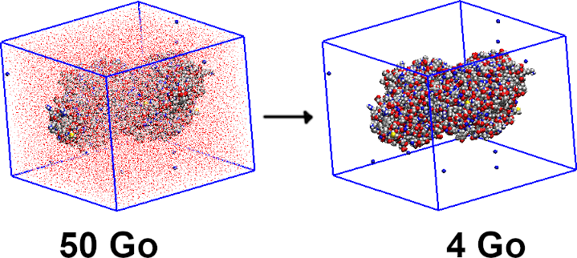

## Description:

Remove water molecules on a trajectory file with the help of cpptraj (Amber)

```markdown
usage dehydrate.pl parameter.prmtop trajectory.nc [Y]
```

The goal of this soft is to remove water molecules from a molecular dynamics trajectory. This way, the trajectory requires less disk space. Beware, if you add the 'Y' optional tag at the end of the command file, the input trajectory file will be removed, this procedure cannot be undone.

At the end, you will get two new files (prmtop and nc) with the DRY prefix.

## Sources:

You can download the zip or tar.gz file by clicking on the respective icon.

[](https://github.com/CTM-ITODYS/dehydrate/archive/refs/tags/1.0.zip)
[](https://github.com/CTM-ITODYS/dehydrate/archive/refs/tags/1.0.tar.gz)

## Contact:

Feel free to contact me if you have questions by clicking the email icon.

[](mailto:florent.barbault@u-paris.fr)

Author: Florent Barbault
